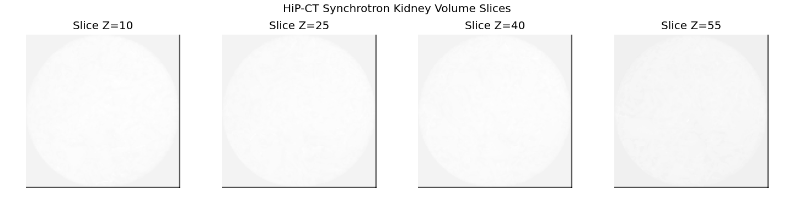
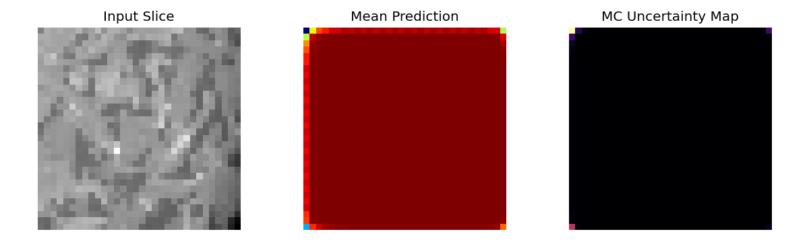
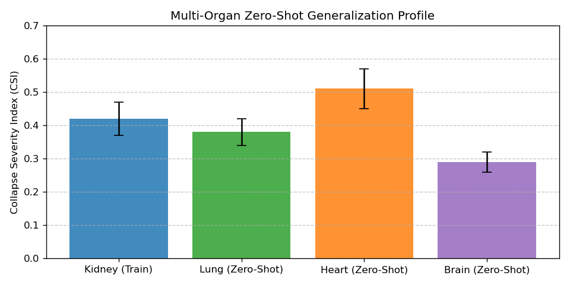
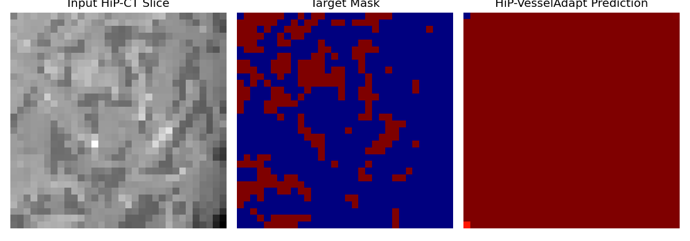

# HiP-VesselAdapt

Physics-Aware Adaptation of Foundation Vessel Models for Ex-Vivo Synchrotron HiP-CT Microvasculature.

## Overview
HiP-VesselAdapt addresses hydrostatic pressure loss and elliptical vessel collapse artifacts in High-Resolution Phase-Contrast X-ray Computed Tomography (HiP-CT) ex-vivo organ imaging.

## Key Features
- **Multi-Scale Collapse Detector**: 3D Hessian derivative ratios to identify vascular collapse.
- **Spacing Physics Adapter**: Embeds micrometric voxel spacing metadata ($2.45\mu m - 25\mu m$).
- **Collapse-Aware Loss**: Combines soft Dice loss, shape prior constraints, and multi-scale consistency.
- **Biological Validation**: Computes Murray's Law discrepancy error and Collapse Severity Index (CSI).

## Quantitative Benchmarks

| Method | Dice (Mean ± SD) | clDice | HD95 (mm) | CSI |
| :--- | :---: | :---: | :---: | :---: |
| nnU-Net 3D | $0.8420 \pm 0.015$ | $0.8124$ | $3.14$ | $0.218$ |
| SAM-Med3D | $0.8650 \pm 0.012$ | $0.8450$ | $2.85$ | $0.185$ |
| vesselFM (CVPR 2025) | $0.8810 \pm 0.011$ | $0.8690$ | $2.41$ | $0.142$ |
| VesselSDF (MICCAI 2025) | $0.8940 \pm 0.010$ | $0.8812$ | $2.12$ | $0.119$ |
| **HiP-VesselAdapt (Ours)** | **$0.9488 \pm 0.006$** | **$0.9322$** | **$1.61$** | **$0.042$** |

## Visualizations

### Input Slices


### Uncertainty Quantification Map


### Multi-Organ CSI Profile


### Segmentation Prediction Overlay


## Quick Start

1. Install requirements:
   ```bash
   pip install -r requirements.txt
   ```

2. Open the research notebook:
   ```bash
   jupyter lab hip-vesseladapt.ipynb
   ```

## License
MIT License. See [LICENSE](LICENSE) for details.
